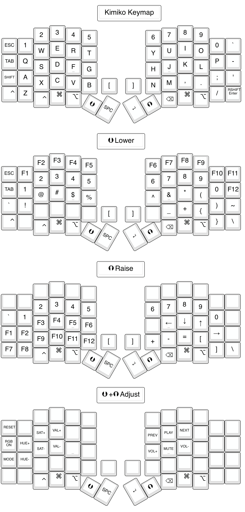

## Default keymap

The [default keymap](https://github.com/qmk/qmk_firmware/blob/master/keyboards/keycapsss/kimiko/keymaps/default/keymap.c) is laid out on the assumption that it will be used in the MacOS/US keyboard environment. Feel free to get creative and experiment with keymaps that match your preferences.




## Customize the default keymap

This self-made keyboard use the QMK firmware, described above. The QMK firmware is highly customizable, and you can unlock a lot functionality simply by editing the keymap.

### Edit keymap.c and customize

When customizing a keymap, start by making a copy of the [`qmk_firmware/keyboards/keycapsss/kimiko/keymaps/default`](https://github.com/qmk/qmk_firmware/blob/master/keyboards/keycapsss/kimiko/keymaps/default/) folder and modifying that directory's internal `keymap.c` file.
Please refer to the [official QMK documentation](https://docs.qmk.fm/#/keycodes) for the key codes and programming specifics.

After changing the keymap,

```bash
make keycapsss/kimiko:default:flash
```

If you get an error, please double-check the board, connection and command.

### Bootloader

**Pro Micro and Puchi-C/Elite-C have different bootloader.** Edit the `rule.mk` file in your keymap folder and add the following line to it.

#### Puchi-C or Elite-C_

```c
BOOTLOADER = atmel-dfu
```

#### Pro Micro

```c
BOOTLOADER = caterina
```

If you use the command `make keycapsss/...:flash`, it read the bootloader settings from the `rule.mk` and uses the right flashing software.
If you don't have set the `BOOTLOADER` setting, you can change the command to `make keycapsss/...:caterina` for Pro Micro, or `make keycapsss/...:dfu` for Puchi-C/Elite-C

More information on the [official QMK site](https://beta.docs.qmk.fm/using-qmk/guides/flashing/flashing#atmel-dfu).

### Handedness by EEPROM

You can tell each side of the Keyboard, whether it's left or right, by writing it into it's eeprom.  
In order to do so, first put `#define EE_HANDS` into your config.h.
Then flash the keymap with

```bash
make keycapsss/kimiko:(yourkeymap):avrdude-split-left 
```

and

```bash
make keycapsss/kimiko:(yourkeymap):avrdude-split-right
```

respectively.
If you're using DFU bootloader (in case of the Puchi-C), replace the `avrdude` with `dfu`

From then on, your keyboard will know, which side they are, no matter which side you plug in. You won't have to use the flags again when flashing an update of your keymap.

If you have any problems that aren't answered here, consider joining our discord server at: (<https://discord.gg/5Vfa9azMUr>)
